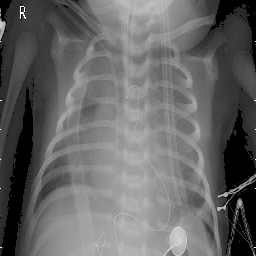

# X-ray Image Classification of Pneumonia in Pediatric Patients

According to the World Health Organization, pneumonia accounts for 15% of deaths in the world for children under 5 years old, but it can be prevented with appropriate nutrition and immunization. Pneumonia that is caused by bacteria can be treated with antibiotics, but only one third of children receive the antibiotics they need (https://www.who.int/news-room/fact-sheets/detail/pneumonia). Across the world, there is a general lack of radiologists, so significant resources are spent in order to determine the results of x-ray images. Building a neural network model that can accurately detect pneumonia from x-ray images could both lessen the need for a radiologist as well as assist medical experts that may misinterpret the x-ray results.

This project involves an iterative approach to building a convolutional neural network model to classify x-ray images of pediatric patients, identifying whether or not patients have pneumonia. Transfer learning was used, but rather than freezing the previously built model, the network was retrained to improve overall accuracy.

### The Data:
The data for this project was downloaded directly from https://www.kaggle.com/paultimothymooney/chest-xray-pneumonia. The data contains 5,856 x-ray images with a mix of RGB and grayscale images.

### Resizing Images:
Images were resized to 75x75 for efficiency when running on a local machine. Additionally, the prebuilt network, InceptionResNetv2, requires that the minimum image size is 75x75.

### Train and Test Sets:
The original train, test, and validation sets were 5,216, 624, and 16 images. All images and labels were combined and then resplit in order to increase the size of the test set to more accurately evaluate model results as 16 images alone would not give a clear picture. The final training set was slightly reduced to 5,153 images, the validation set was used in the modeling process to gauge model accuracy with 632 total images, and the test set was used to further gauge how the model would handle unseen data with 71 total images.

### Data Augmentation
Data Augmentation was performed on the train set to increase our data set to improve accuracy. The initial training set was doubled with images having Pixel values under 40 replaced with 0. Essentially, this converts darker gray areas to black and allows the model to focus on the more important, lighter areas. Below is an original image compared to an altered image:

Original

Altered

### Transfer Learning

Below is the structure of InceptionResNetV2. This prebuilt network was retrained, flattend to a 1D array, then fed through a dense layer with 75 neurons and a relu activation function, and finally through the output layer with a sigmoid activation function using binary crossentropy as the loss function and accuracy as the metric.

The optimizer used was Stochastic Gradient Descent (SGD) with a learning rate of 0.01 and momentum of 0.9 to accelerate convergence. The batch size was 100 with total epochs at 50. Using the Model Checkpoint callback, the best model was saved according to highest validation accuracy.

### Final Model Confusion Matrix

# Conclusion: 

The final model resulted in 98.6% accuracy on the unseen test set, predicting only 1 false positive and 0 false negatives. Further research can include classifying whether pneumonia is bacterial or viral.

